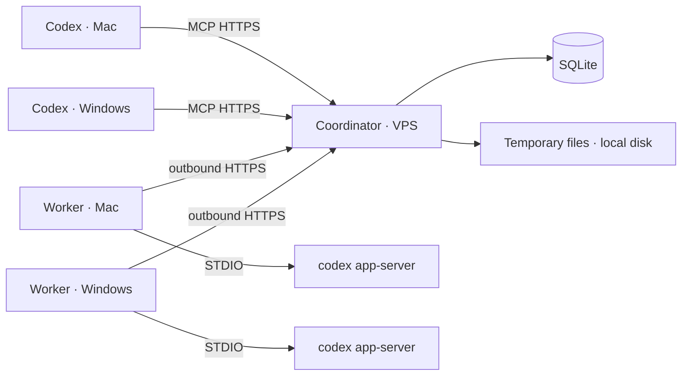

# Архитектура MVP

## 1. Общая схема



Coordinator реализует mailbox и presence. Worker управляет локальным агентом.
Production coordinator размещается на SSH-host `clawvpn`.

## 2. Стек

- TypeScript;
- Node.js LTS;
- SQLite;
- Streamable HTTP MCP;
- HTTPS API для worker;
- long polling;
- `codex app-server` по STDIO;
- Caddy для TLS;
- локальная папка временных файлов на VPS.

## 3. Coordinator

Обязанности:

- аутентифицировать worker и MCP-клиентов;
- хранить состояние агентов;
- принимать heartbeat;
- хранить краткие project descriptors, опубликованные worker;
- сохранять и маршрутизировать сообщения;
- выдавать cursor для ожидания;
- хранить временные файлы и удалять их по TTL.

Coordinator не управляет Codex thread и не читает локальные проекты.

## 4. Worker

Обязанности:

- поддерживать agent identity;
- long polling входящих сообщений;
- публиковать доступные локальные Codex-проекты;
- разрешать `projectId` в primary folder и дополнительные roots;
- запускать app-server по запросу;
- хранить локальное сопоставление корневого `messageId` с `threadId` и
  `projectId`;
- выводить status из событий app-server;
- вести очередь новых запусков;
- доставлять связанное сообщение в активную сессию;
- автоматически публиковать result;
- проверять и разрешать Git-вложения в выбранном проекте;
- загружать и скачивать временные файлы;
- останавливать app-server после idle timeout.

Локальное состояние worker:

```json
{
  "agentId": "mac-codex",
  "threads": {
    "msg_123": {
      "threadId": "019bbb20-...",
      "projectId": "project_agent_operator"
    }
  },
  "activeRequestId": "msg_123",
  "currentProject": {
    "id": "project_agent_operator",
    "displayName": "Agent Operator"
  }
}
```

## 5. SQLite

### `agents`

```text
id
name
token_hash
status
current_project_id
current_project_name
current_activity
active_request_id
last_seen_at
created_at
updated_at
```

### `agent_projects`

```text
agent_id
project_id
display_name
availability
primary_folder_name
additional_folder_count
last_seen_at
```

Worker остаётся источником истины. Таблица является кэшем дескрипторов и не
содержит абсолютные пути.

### `messages`

```text
id
sender_agent_id
recipient_agent_id
kind
body
project_id
project_name
reply_to
delivery_mode
status
cursor
created_at
delivered_at
completed_at
```

### `temporary_files`

```text
id
owner_agent_id
original_name
storage_name
content_type
size
sha256
expires_at
created_at
```

Вложения сообщения хранятся как JSON-метаданные. `temporary_file` ссылается на
запись `temporary_files`.

## 6. MCP-контракт

### `agents_list`

Возвращает краткий список зарегистрированных worker-агентов. Чаты и полный
список проектов в ответ не входят.

```json
{
  "agents": [
    {
      "id": "mac-codex",
      "status": "busy",
      "currentProject": "Agent Operator",
      "currentActivity": "Изучаю структуру проектов"
    }
  ]
}
```

### `agent_status`

Возвращает подробное состояние конкретного агента и cursor последнего
изменения.

### `agent_projects`

```json
{
  "agentId": "mac-codex"
}
```

Возвращает опубликованные project descriptors:

```json
{
  "projects": [
    {
      "id": "project_agent_operator",
      "displayName": "Agent Operator",
      "availability": "available"
    }
  ]
}
```

### `agent_start`

```json
{
  "agentId": "mac-codex",
  "projectId": "project_agent_operator",
  "message": "Изучи структуру проектов и подготовь рекомендации.",
  "attachments": [
    {
      "type": "git_file",
      "repository": "git@github.com:example/project.git",
      "revision": "a12bc34d",
      "path": "docs/plan.md",
      "sha256": "..."
    }
  ]
}
```

Создаёт корневое сообщение без `replyTo`. Свободный агент создаёт свежий
thread в выбранном проекте. Занятый агент сохраняет запуск в очереди.
`attachments` принимает до 20 Git-файлов.

### `agent_send`

```json
{
  "agentId": "mac-codex",
  "message": "Обрати внимание на архивные проекты.",
  "replyTo": "msg_123",
  "attachments": []
}
```

`replyTo` должен указывать активный или известный запрос получателя.
Если связанный thread сейчас активен, worker использует steering или безопасную
границу. Если thread завершён, worker вызывает `thread/resume` и начинает новый
turn. Если агент занят другим thread, сообщение ожидает освобождения.

### `agent_wait`

```json
{
  "agentId": "mac-codex",
  "afterCursor": 42,
  "timeoutMs": 30000
}
```

Возвращает новые сообщения и актуальный status. Timeout ограничен серверной
конфигурацией.

## 7. Worker API

```text
POST /v1/agents/register
POST /v1/agents/heartbeat
POST /v1/agents/projects
POST /v1/messages/poll
POST /v1/messages/{id}/delivered
POST /v1/messages
POST /v1/files
GET  /v1/files/{id}
POST /v1/files/{id}/ack
```

Worker использует только исходящие HTTPS-запросы.

## 8. Доставка сообщений

### Свободный агент

```text
agent_start queued
  → worker получает сообщение
  → worker разрешает projectId
  → lazy-start app-server
  → thread/start
  → cwd = primary folder
  → additional roots = secondary project folders
  → turn/start
  → busy
```

### Занятый агент

Связанный `agent_send` доставляется в активный turn через поддерживаемый
механизм steering или на ближайшей безопасной границе. Точное поведение
проверяется в техническом эксперименте.

Несвязанный `agent_start` остаётся в очереди до `turn/completed`.

### Завершение

```text
item/completed(agentMessage)
  → worker сохраняет финальный текст
turn/completed
  → worker выбирает final_answer для завершённого turn
  → создаёт result
  → result.replyTo = activeRequestId
  → status = idle
  → запускает следующий agent_start
```

При ошибке worker создаёт сообщение `error` и продолжает очередь.

## 9. Локальная Codex-сессия

Worker хранит mapping `rootMessageId → threadId + projectId` локально.
Coordinator получает status, активное входящее сообщение и снимок названия
проекта.

### Новый запуск

1. Worker получает `agent_start`.
2. Разрешает `projectId` в локальный проект Codex.
3. Проверяет availability.
4. Создаёт свежий thread.
5. Запускает turn с primary folder как `cwd`.
6. Сохраняет mapping по ID корневого сообщения.

### Продолжение

`agent_send` с `replyTo` проходит по цепочке сообщений к корневому запросу.
Worker находит mapping и продолжает соответствующий thread в прежнем проекте.

После перезапуска:

1. Worker загружает локальный `threadId`.
2. Запускает app-server.
3. Вызывает `thread/resume`.
4. Продолжает очередь сообщений.

Codex App Server поддерживает создание, возобновление, steering, interrupt,
передачу `cwd` и поток событий. Официальное описание:
<https://learn.chatgpt.com/docs/app-server>.

Публичная документация не фиксирует API списка локальных Codex-проектов и
стабильность их ID. `AOP-001` проверяет сгенерированные app-server schemas и
локальную модель проекта. Fallback — worker-local registry с непрозрачными ID;
coordinator получает только дескрипторы.

## 10. Передача Git-файла

Отправитель формирует:

```json
{
  "type": "git_file",
  "repository": "git@github.com:example/project.git",
  "revision": "a12bc34d",
  "path": "docs/plan.md",
  "sha256": "..."
}
```

Получатель:

1. Проверяет относительный Git path и формат commit hash.
2. Сопоставляет repository с remote выбранного локального проекта, учитывая
   SSH- и HTTPS-формы одного URL.
3. Проверяет наличие commit в локальной object database.
4. Выполняет `git fetch` совпавшего remote, если commit отсутствует.
5. Разрешает полный commit hash и проверяет наличие path через `git cat-file`.
6. Потоково вычисляет SHA-256 содержимого blob.
7. Добавляет в prompt проверенный manifest и инструкцию
   `git show <revision>:<path>`.

Worker не выполняет checkout, не меняет текущую ветку и не применяет commit
автоматически. Ошибка repository, revision, path или checksum завершает запрос
со статусом `failed` до запуска Codex turn.

## 11. Передача временного файла

1. Отправляющий worker проверяет файл и размер.
2. Вычисляет SHA-256.
3. Загружает файл coordinator.
4. Coordinator создаёт непрозрачный `fileId`.
5. Получающий worker скачивает файл в свой temp directory.
6. Worker проверяет размер и SHA-256.
7. Codex получает локальный временный путь.
8. После ack или TTL файл удаляется.

Coordinator принимает файлы только через явную операцию отправителя.

Начальные ограничения задаются конфигурацией:

```text
maximum file size
allowed content types
retention period
per-agent quota
```

## 12. Жизненный цикл app-server

```text
worker online
  → входящее сообщение
  → start app-server
  → initialize
  → resume thread
  → process turns
  → idle timeout
  → graceful shutdown
```

Worker остаётся онлайн после остановки app-server.

Стартовая конфигурация:

```text
max active turns: 1
idle timeout: 5 minutes
heartbeat: configurable
polling: long polling
```

Технический эксперимент измеряет:

- idle CPU worker;
- idle RSS worker;
- RSS app-server;
- cold-start time;
- `thread/resume` time;
- active CPU/RSS;
- корректное освобождение процесса.

Документация Codex не задаёт численные resource budgets, поэтому пороги
фиксируются после измерения на Mac и Windows.

## 13. Безопасность MVP

- HTTPS;
- случайный token на агента;
- хеш token в SQLite;
- отзыв token;
- ограничение размера файлов;
- безопасные имена файлов;
- непрозрачные storage names;
- checksum;
- TTL;
- очистка содержимого сообщений и путей из технических логов;
- OpenAI credentials только на локальном host.

## 14. Структура репозитория

```text
agent-operator/
├── apps/
│   ├── coordinator/
│   └── worker/
├── packages/
│   ├── protocol/
│   └── app-server-client/
├── docs/
│   ├── adr/
│   ├── ARCHITECTURE.md
│   ├── CHECKPOINT_WINDOWS.md
│   ├── DEPLOYMENT_CLAWVPN.md
│   └── PROJECT_BRIEF.md
├── KANBAN.md
└── README.md
```

## 15. Вертикальный прототип

```text
Windows Codex
  → agent_status(mac-codex)
  → agent_projects(mac-codex)
  → agent_start(mac-codex, projectId)
  → Mac worker starts Codex
  → Windows agent_wait(cursor)
  → Mac turn/completed
  → automatic result
  → Windows receives Git or temporary attachment
```

## 16. Production target

Coordinator разворачивается контейнером на `clawvpn`. Профиль сервера и
ограничения deployment описаны в
[`DEPLOYMENT_CLAWVPN.md`](DEPLOYMENT_CLAWVPN.md).

Реальный Windows-worker подключается на обязательной контрольной точке
[`CP-WIN-01`](CHECKPOINT_WINDOWS.md). До неё используются локальные тестовые
agent identities. На checkpoint основной Codex формирует актуальную задачу для
Windows Codex с фактическими командами, URL и версией worker.
